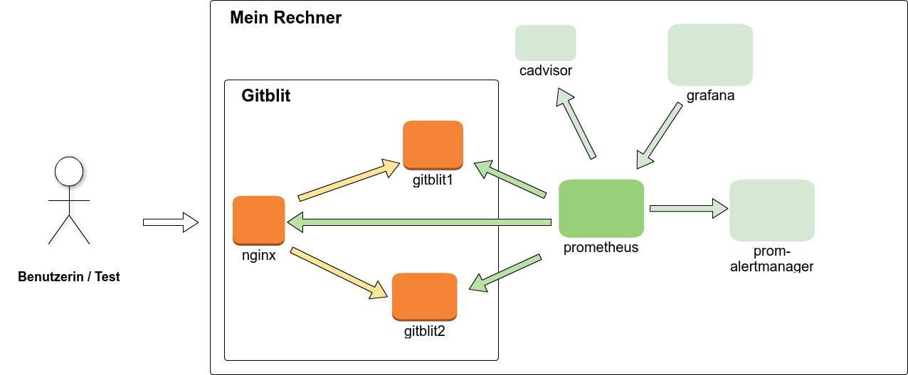
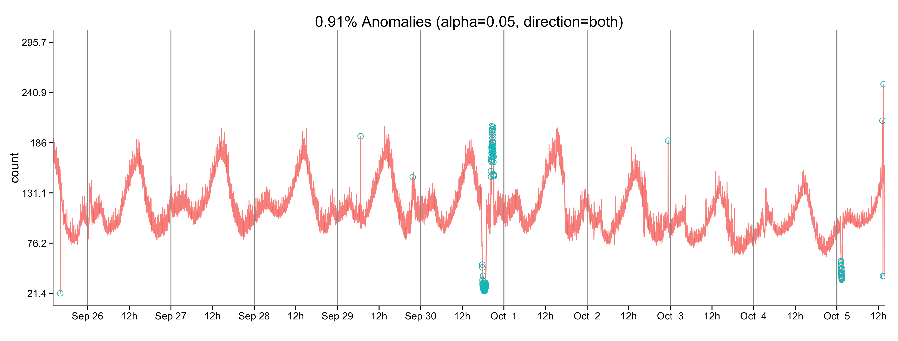

<!DOCTYPE html>
<html>
  <head>
    <title>Softwaremonitoring mit Prometheus</title>
    <meta charset="utf-8">
    <style>
      @import url(https://fonts.googleapis.com/css?family=Yanone+Kaffeesatz);
      @import url(https://fonts.googleapis.com/css?family=Droid+Serif:400,700,400italic);
      @import url(https://fonts.googleapis.com/css?family=Ubuntu+Mono:400,700,400italic);
      @page {
        size: 1210px 681px;
        margin: 0;
      }
      
      @media print {
        .remark-slide-scaler {
          width: 100% !important;
          height: 100% !important;
          transform: scale(1) !important;
          top: 0 !important;
          left: 0 !important;
        }
      }
    
          body { 
        font-family: 'Droid Serif';
        margin: 0px;
      }
      h1, h2, h3 {
        font-family: 'Yanone Kaffeesatz';
        font-weight: normal;
        color: #475b80;
      }
      h3 {
          font-size: 30px;
          margin-top: -45px;
      }
      
      img {
          max-width: 100%;
      }


      h1 {
          border-bottom: 1px solid black;
      }

      /* Two-column layout */
      .left-column {
          width: 50%;
          float: left;
      }
      .right-column {
          width: 49%;
          float: right;
          padding-top: 0em;
          margin-top: 0em;
          text-align: left;
      }


      ol {
          padding: 0 0 0 1.5em;
          margin: 1em 0;
      }
      
      ul {
          list-style-type: none;
          margin: 0;
          padding: 0;
      }

      li {
          padding-left: 1em;
          padding-top: 0.5em;
      }

      ul li ul li  {
          padding-left: 2em;
          padding-top: 0.2em;
      }


      li:before {
          content: "\25cf";
          display: inline-block;
          width: 1.5rem;
      }

      .remark-code, .remark-inline-code { 
        font-family: 'Ubuntu Mono'; 
        font-size: 27px;
      }
      blockquote {
          border-left: 5px solid #cccccc;
          padding-left: 1em;
          margin: 1em -2em;
          font-style: italic;
          color: #999999;
      }
      
      .remark-slide-number {
          display: none;
      }
      
      .remark-slide {
          display: table;
      }
      
      .remark-slide-content {
          border-bottom: 50px solid #475b80;
          background-color: #ebf6ff;
          font-size: 26px;
          padding: 0.5em 2em 0.5em 2em;

      }

      .remark-slide-content:after {
          content: "";
          position: absolute;
          bottom: 0px;
          right: 0px;
          height: 50px;
          width: 118px;
          background: url('data:image/png;base64,iVBORw0KGgoAAAANSUhEUgAAAHYAAAAyCAYAAACJbi9rAAAABGdBTUEAALGPC/xhBQAACjppQ0NQUGhvdG9zaG9wIElDQyBwcm9maWxlAABIiZ2Wd1RU1xaHz713eqHNMBQpQ++9DSC9N6nSRGGYGWAoAw4zNLEhogIRRUQEFUGCIgaMhiKxIoqFgGDBHpAgoMRgFFFReTOyVnTl5b2Xl98fZ31rn733PWfvfda6AJC8/bm8dFgKgDSegB/i5UqPjIqmY/sBDPAAA8wAYLIyMwJCPcOASD4ebvRMkRP4IgiAN3fEKwA3jbyD6HTw/0malcEXiNIEidiCzclkibhQxKnZggyxfUbE1PgUMcMoMfNFBxSxvJgTF9nws88iO4uZncZji1h85gx2GlvMPSLemiXkiBjxF3FRFpeTLeJbItZMFaZxRfxWHJvGYWYCgCKJ7QIOK0nEpiIm8cNC3ES8FAAcKfErjv+KBZwcgfhSbukZuXxuYpKArsvSo5vZ2jLo3pzsVI5AYBTEZKUw+Wy6W3paBpOXC8DinT9LRlxbuqjI1ma21tZG5sZmXxXqv27+TYl7u0ivgj/3DKL1fbH9lV96PQCMWVFtdnyxxe8FoGMzAPL3v9g0DwIgKepb+8BX96GJ5yVJIMiwMzHJzs425nJYxuKC/qH/6fA39NX3jMXp/igP3Z2TwBSmCujiurHSU9OFfHpmBpPFoRv9eYj/ceBfn8MwhJPA4XN4oohw0ZRxeYmidvPYXAE3nUfn8v5TE/9h2J+0ONciURo+AWqsMZAaoALk1z6AohABEnNAtAP90Td/fDgQv7wI1YnFuf8s6N+zwmXiJZOb+DnOLSSMzhLysxb3xM8SoAEBSAIqUAAqQAPoAiNgDmyAPXAGHsAXBIIwEAVWARZIAmmAD7JBPtgIikAJ2AF2g2pQCxpAE2gBJ0AHOA0ugMvgOrgBboMHYASMg+dgBrwB8xAEYSEyRIEUIFVICzKAzCEG5Ah5QP5QCBQFxUGJEA8SQvnQJqgEKoeqoTqoCfoeOgVdgK5Cg9A9aBSagn6H3sMITIKpsDKsDZvADNgF9oPD4JVwIrwazoML4e1wFVwPH4Pb4Qvwdfg2PAI/h2cRgBARGqKGGCEMxA0JRKKRBISPrEOKkUqkHmlBupBe5CYygkwj71AYFAVFRxmh7FHeqOUoFmo1ah2qFFWNOoJqR/WgbqJGUTOoT2gyWgltgLZD+6Aj0YnobHQRuhLdiG5DX0LfRo+j32AwGBpGB2OD8cZEYZIxazClmP2YVsx5zCBmDDOLxWIVsAZYB2wglokVYIuwe7HHsOewQ9hx7FscEaeKM8d54qJxPFwBrhJ3FHcWN4SbwM3jpfBaeDt8IJ6Nz8WX4RvwXfgB/Dh+niBN0CE4EMIIyYSNhCpCC+ES4SHhFZFIVCfaEoOJXOIGYhXxOPEKcZT4jiRD0ie5kWJIQtJ20mHSedI90isymaxNdiZHkwXk7eQm8kXyY/JbCYqEsYSPBFtivUSNRLvEkMQLSbyklqSL5CrJPMlKyZOSA5LTUngpbSk3KabUOqkaqVNSw1Kz0hRpM+lA6TTpUumj0lelJ2WwMtoyHjJsmUKZQzIXZcYoCEWD4kZhUTZRGiiXKONUDFWH6kNNppZQv6P2U2dkZWQtZcNlc2RrZM/IjtAQmjbNh5ZKK6OdoN2hvZdTlnOR48htk2uRG5Kbk18i7yzPkS+Wb5W/Lf9ega7goZCisFOhQ+GRIkpRXzFYMVvxgOIlxekl1CX2S1hLipecWHJfCVbSVwpRWqN0SKlPaVZZRdlLOUN5r/JF5WkVmoqzSrJKhcpZlSlViqqjKle1QvWc6jO6LN2FnkqvovfQZ9SU1LzVhGp1av1q8+o66svVC9Rb1R9pEDQYGgkaFRrdGjOaqpoBmvmazZr3tfBaDK0krT1avVpz2jraEdpbtDu0J3XkdXx08nSadR7qknWddFfr1uve0sPoMfRS9Pbr3dCH9a30k/Rr9AcMYANrA67BfoNBQ7ShrSHPsN5w2Ihk5GKUZdRsNGpMM/Y3LjDuMH5homkSbbLTpNfkk6mVaappg+kDMxkzX7MCsy6z3831zVnmNea3LMgWnhbrLTotXloaWHIsD1jetaJYBVhtseq2+mhtY823brGestG0ibPZZzPMoDKCGKWMK7ZoW1fb9banbd/ZWdsJ7E7Y/WZvZJ9if9R+cqnOUs7ShqVjDuoOTIc6hxFHumOc40HHESc1J6ZTvdMTZw1ntnOj84SLnkuyyzGXF66mrnzXNtc5Nzu3tW7n3RF3L/di934PGY/lHtUejz3VPRM9mz1nvKy81nid90Z7+3nv9B72UfZh+TT5zPja+K717fEj+YX6Vfs98df35/t3BcABvgG7Ah4u01rGW9YRCAJ9AncFPgrSCVod9GMwJjgouCb4aYhZSH5IbyglNDb0aOibMNewsrAHy3WXC5d3h0uGx4Q3hc9FuEeUR4xEmkSujbwepRjFjeqMxkaHRzdGz67wWLF7xXiMVUxRzJ2VOitzVl5dpbgqddWZWMlYZuzJOHRcRNzRuA/MQGY9czbeJ35f/AzLjbWH9ZztzK5gT3EcOOWciQSHhPKEyUSHxF2JU0lOSZVJ01w3bjX3ZbJ3cm3yXEpgyuGUhdSI1NY0XFpc2imeDC+F15Oukp6TPphhkFGUMbLabvXu1TN8P35jJpS5MrNTQBX9TPUJdYWbhaNZjlk1WW+zw7NP5kjn8HL6cvVzt+VO5HnmfbsGtYa1pjtfLX9j/uhal7V166B18eu612usL1w/vsFrw5GNhI0pG38qMC0oL3i9KWJTV6Fy4YbCsc1em5uLJIr4RcNb7LfUbkVt5W7t32axbe+2T8Xs4mslpiWVJR9KWaXXvjH7puqbhe0J2/vLrMsO7MDs4O24s9Np55Fy6fK88rFdAbvaK+gVxRWvd8fuvlppWVm7h7BHuGekyr+qc6/m3h17P1QnVd+uca1p3ae0b9u+uf3s/UMHnA+01CrXltS+P8g9eLfOq669Xru+8hDmUNahpw3hDb3fMr5talRsLGn8eJh3eORIyJGeJpumpqNKR8ua4WZh89SxmGM3vnP/rrPFqKWuldZachwcFx5/9n3c93dO+J3oPsk42fKD1g/72ihtxe1Qe277TEdSx0hnVOfgKd9T3V32XW0/Gv94+LTa6ZozsmfKzhLOFp5dOJd3bvZ8xvnpC4kXxrpjux9cjLx4qye4p/+S36Urlz0vX+x16T13xeHK6at2V09dY1zruG59vb3Pqq/tJ6uf2vqt+9sHbAY6b9je6BpcOnh2yGnowk33m5dv+dy6fnvZ7cE7y+/cHY4ZHrnLvjt5L/Xey/tZ9+cfbHiIflj8SOpR5WOlx/U/6/3cOmI9cmbUfbTvSeiTB2Ossee/ZP7yYbzwKflp5YTqRNOk+eTpKc+pG89WPBt/nvF8frroV+lf973QffHDb86/9c1Ezoy/5L9c+L30lcKrw68tX3fPBs0+fpP2Zn6u+K3C2yPvGO9630e8n5jP/oD9UPVR72PXJ79PDxfSFhb+BQOY8/wldxZ1AAAAIGNIUk0AAHomAACAhAAA+gAAAIDoAAB1MAAA6mAAADqYAAAXcJy6UTwAAAAGYktHRAD/AP8A/6C9p5MAAAAJcEhZcwAACxMAAAsTAQCanBgAAAAHdElNRQfhBQcKKxO7ouwvAAAOvUlEQVR42u2ce7wV1XXHv+dw4XJBEBweCoOMMoqP1CQejDUZjSaNkib9VGwTX41pk9Ya06rVGmJqbB5gCElFP0mjEBtiG40m1opGYyOgiUc/PjKiQqHBQQYciBBH4AJyuYV7+sf+je5Mzjn3HK6Xa/Ssz+d+DjOzZ+2913utvQZoQQta0IIWvB2g7JWaut+CvkOhFsGDOOz1XiMMzd4pe6UDgI8BhwEvAj8K4nBbiwX9A23VbgZxSNkrDQYmA0VgdbNMzTG4BCwGRgF7gZW6bjF2fzJWcDLwn8AQ4HTg0WaRW8JwlZh6F/DvwE5gc4v8A8NYT8wAOHJfGCttPQSYpMu/D+JwY1/Mewv6ztgfAeOACnBLH+boANqlwRtraHQLBiKKLXulpiJYe2zZKx1e9krPlr1SpdmI2J630fmrrbXeu/Xw5/bR0Fx9oVu/R8Va1FDABzqCOHxK99qAo4ChwDPAaOA4YCSwA1gVxGGise16NhH4hnCVNOeLQRxuzkxx2Ss5wLHCtxd4CVgRxGFXbk0jgSnA3iAOnyt7pSOEtx1IgWeDOOy08NrB4EjNMVboXgb+J4jDbdb4ocA7gV3AC0Ec7shF9kXtaRDwfBCHnbo/WnQZo2edev7iQLmcYp1nk4Abgfute8N1717gI/pdrKDoAeCOslc6WWMnAI/JjB+me0uAB4EZFsH/DFik+3cL50+BW8pe6cicthwP/BBYWPZKZ2nu+4H/Au4D5pe90qQqTD1N7/1Ucy3Sen9c9koftoi+B7hNa/hQFW09Hrgd+LH17HxdLwHu0VqWAHeWvdJ5A2V1i7343/GSQnv8eOBgYIE0bCbwBWnMe4Evl73SWEntzWL6Fr3/PTF6lYhygQj5PmAp8A/A1dLYjwNLyl5pnEX4ocAhwDHC9SvgEmAeMAI4B/iMUrWMqR9QJP7HwBrgSuAKreFDEpJM0PYAPwEOBT5a9kodOU07B5gKPJ1pKzAd+CDwTWnzVGAW8B5gdtkrTRuIWKKtl+eVOvc2ANOCOOwRkxYACXAaMDGIw2dE5MMk6WOCOLzCkvSDgfm6/McgDv/FenYdcBNwgZgy3Zq7R6b3e0EcftZ652fSyNOBG4I43CQTfxXgAnODOJxp7eO6slf6GvB54HNlr/RkEIcbxKBLJAgTgUgCMlYCCDDHwvPXwDVBHK617n2x7JXGA3+jd375ZmNsPfh6EIc9lpnaprz3fEXCtpZX8+V/pxx5ecZUy3zuEnNPBc4oe6VDgzhcb727F/innJl8VLnxBGCI7nvAHwGrgaur+N6r5Ar+EHiXhHWTTPWfAkHZK60J4rACTJP/XRnE4S8tHLuBtRLUkdpTRdYkc19vKlPcGzydmTvL1GxrAu80jVtsBxgWrpUyyYjBdsDXGcTh1tw7BZn8QZYgvUO/P7OFK2caF+nXV3DULSsBcFkQhxWZ9lMlsNfmKnRTy15pjvxyCCwHVkjza1m9NzVju5uJsqvAoDp4Mq2s5MZmsKvBudusoKhiMzQXML02VvdD4FngnWWvNE2a+DHFEQ9aTJ0CLFScsRO4TP72JMUKAwZ9YWyhj3OvEONOtQltmVYfcPTvsNrcDQQlK/V7ItBWIy89Rb9rsnghiMN1imxRsHWUIvsfAFutd2eIiXcGcXiq/P7SIA4fVzr1e8nYvsJC4FVpxcdz5q0D+JSY+2wQh8/tY536BeApEX+G/N9rFqPslf5ckfxzMqE2w+8FfqPoPNO+nwRx2G0JVJYxPK45bbP7yTdrSbFfK1sqMMwBvgp8v+yVjpffHqKI9FwR9hP7Oo8i42vlM28FTi57pZ/LUgQK4HYB1wVxuMa2AkEcPlz2SqtV0JgOPCIBsAsOz2uqi8teaYXWO0yR8lG2ddnfRYpiLz7wwCom8MAa7xasCLAth2dkDcLPAj6taHYmcAfwH2LqQ8CZQRwut7RosOYfVcM1jFJuXbTeuVv4lgEXqVBxu5i6AviLIA5vqVFeXGjhfySIw805F3CH0rLDVfBYLAE4ArhQY0YNRF28nsauVhpgm69t1r0Xc+P3yB/NAeycbi3wfhUXbHObbXahzN4fqOTXJfMZBXG4I0eUpTLPPVXW26m1FYEkN8d9Za/0mMqRJ0gIQpX9XslrlDXfD4BfSMM32+P0u6PslS4Hvi0LMFgCtELB1DHS4t+vQ4BmC+DN4Ojt3WaL62/E+GZp0Jf5W9CCFrSgBS1oQQtaMNCQuv4bOq4/19Ufa2gEZ7PzvhHrtHH0hq9QB8l44GLMwXYGFWAr8HMnie7PJnCSaH8ydwrmjPUpJ4nm9+M8ZwIfzeXM/6dq0+1OEr2Uun7BSaJKEzgnA9dguj0WOUm0txmmZnROXb/NSaI9+8rYqZg2j6Nzj3owZbh7nCQ6bwCsyV2Yuu964EwniZb10zzXSoDy0I05HrzISaK7mxHs1PVvxlTa1gInOUm0qRmmpq4/GtM5MttJorqH970dAmSMfxLT4nI3puI0DDgrdf0LGzEN2bPezEfq+o2YrJWY6tRWYGOjhGl0DVVgJ6/3Yj0mrR0PXJ+6/tEieKMmeIV+I2B3k0w9AtOJcaatkLXmbvQQ4CtOEt1nIVuH6Qs6GdP7ZJuJsZjCeRHY4iTRhmzz1pgRmHaVYdKAxEmiLdbzdkxbSreTREnq+uMw9eaNThJdnbr+YqDoJNGm1PWLwlXAlP32YEqHw4HtQOwkUXfGXIsRkzB15y4J60jgAGCrk0RbrL1vcJJohrX3EuY0ZzKmoW+VtW4PU6uuAK84SbTeZryTRNenrh9iTrU6U9cviI4FraGIKZkOw5RIIyeJKqnrZ92h7VrGIanrTwK2OUnU2RfGtueuEy1oSE66LpWZnIIp/q9PXf9O4F+dJNqVuv4g4GxMUf4dwEGYttXnUtefBTwqIh0tLXk8df07MAfYo4GLU9ffgumFOjp1/ZNEhB9qvoWYAvwM4X4ZWJS6/iwnibZqjQdimtk+jGnK24HplZqkeecD38pbNYs5oZhzot4hdX0Xc4hxioSsB1iXuv6DwA1OEr2kccdoL1v1uwtzkDAY+DLwJ5hWnlGYGvO9WuvhWlPWOjtXc8zCNAPuM2PHSWvagA9gmtN6gP+1mLoAc1xVkBb2KPA6ESikrj9PgnCdTBki6gT9HYEp4r8sbZss5pzB66c5I3T9V8AKaUMbpl9pmHAcZK17lAizWv5tEKa15eLc/o7SejPtrwqWL31t/dKcBzHdiTaMwfRRn5C6/nlOEm3GHP+dhfnKoiJavVt0+S7mywt77Zenrv88pp9rshXAZnMduq8+NoPvYPqPEszZ5lBMK+f1Yup0TEdejwg30kmiDl4/oL4K0w3RBXxJkjhB5u8w4ZqCOSGxYYQ2+Dkx72ExkFyknkWuBwH/LU1qkyYjTRgiyc+YOl9zH4fpTS5awWFNpqau/8+YJrkuzPnsfBF6J/C3mrcIZB2UHwQ+K40fYq2Z3HzjML1ZY+QSsn7uC50kWo5pFlgvYXif5phbi2GNauw2bSQzy6Nlxs7AnG1eZgUFS4CSfN/T0sAxwFRFgTfJvE7QAscBsRh7rEywDV9wkugblmWo15ITAp+U7wVzuH6utLCC6VsCKAMznSTaJpwzMUdsXhWcU1LX76rikpaILu/W9ZecJFpgBTzfEQ2+BVwKzO6Fxo87SXSGtc8npOG+lWq9lnYpzarUisobZexs5V6DZee/Kgm6InX9+zBnqUhyl9TA4QG/SF3/05hD7nc1KGg3VtHQarAXeMBiKpYwFvXekbpexm83xG0Afl2DsRXhKSjo+TXmjPaLEuys8eD6KiZ7sfzpKAl3vZx3ruXHUdTcw+828tVyD/vE2BecJFplSdMORYaezNkgLXo1ppOgPUeYDmBZ6vofwXwdgN5/RBp9ukxWfuMbga4Gc8U9wLpexuy11lTJrbEW0TdiWnWGi9BbgOfl39uz1KNOwWBPg25vU26P9SxTr0WRRhlbzFU/XrXu71U1Zrw2/XndK1hjepRyzLb825XShA5Mh0UtohSaqGxVMimukt8Vpal/KQszAnjF8m8H1cDZJR9XDdYqpRqauv75ThLdmtO646Spu5WK9aWz0xa+YbkcNwukLpEfn9do8DQ8df0OYKSqH9/W/fViZmYupykKHSotHq4A6kZNPtzy2bu00UAagQjURmNN1sXU9Yf0QqzsWdZ3dZeuTwM+kbr+SKU/Z/N681kz8LCsFMC81PXfo70PS13/BODf9Oy7OR85uEoK2RtslhABfEbWokMxRwHTz7VM5v+KRitPN2E+fUgk5adIm251kmijk0S3YT7vaFNu9ZSI+AzmU4xPKSLNotRLFV3fLN+dwZWYts3uOuYre3YM8DXNWbD+qpnBY4HvO0mU6J3MJ67ANIZ/pc7ei3UqQhXgcgV/Y4EnMH1ZS1WtO0CR8zc1Nlv7WZgP0Hos/IUqbqMoIXlAa1+qZ+fI2s21BGSwrJ8LdNVjbI/yzB2aZJD+XpakXgTcYI2/QAXuFxRETZd5eEKM3Yj50u7rkt5zMa2ly0Xkddpcu8WQ7VW09x6lR90ySRVVaTr53a8K1qgMt9uyFnOUkm1RWjRZlifNm2Dh66wVtIi5Tyravk1W6CTl7p2q657tJFHm+x+SEFQshnRqrryPfkhCsd0K0K5RILtK7+wUnyoS0DGq2P2q3iHAYPnNwdUY7iRRmqvIoPD+EPmrA0S81Emi3+TwThTuXTIxr8jPtavisltE361yYyVXG52osdv1bvZ/XKROEm23xhaVP4+Qr9xoPTtUa+iWX1oozb7cSaJ5cjmjs7JmvTqw9j5c+BwpwhYFRK9aYwuiT4ei5VQBaFHl0q5cWnewTHu3k0QbspMdWYehcmlbLEGZIP5s4o2GfNBS7bqZc8V+WN97U9efm7r++NT1C6nrH5i6/oLU9Sv6O7w/9r0f9vVb/y7wNgIFHDcpMs58sJ0Z3OAk0WX7+4y5P6CNtxf0KLCboGLFKKVua1TxmvdWYGpvSfBbWXOzkmiHArlNKtLzVmHs242hfXreghYMOPw/EPbgPbqHSEIAAAAASUVORK5CYII=');

      }
      .cite {font-size: 0.8em; color:#33AA99;font-style: italic}
      .footnote {
        position: absolute;
        bottom: 3em;
      }
      .twitter {
              position: absolute;
              bottom: 0.3em;
              left: 0.5em;
      }

    </style>
  </head>
  <body>
    <textarea id="source">

---

name: twitter 
layout: true 

.twitter[<a href="https://twitter.com/goettl" class="twitter-follow-button" data-show-count="false">Follow @goettl</a><script async src="//platform.twitter.com/widgets.js" charset="utf-8"></script>]

---

class: middle,center

# Softwaremonitoring mit Prometheus
.center[Georg Öttl]

???
Ich werde euch in der nächsten Stunde Softwaremonitoring mit Prometheus näherbringen. Mit der DevOps Brille aufgesetzt. 

Es wird darum gehen, wie Monitoring durchgängig von Entwicklung bis zum Betrieb genutzt werden kann.
Was sind die Vorteile, warum geht das so toll mit Prometheus und warum sollte man das überhaupt
machen.

---

.center[**Übersicht**]

* Beruflicher Kontext
* Monitoring, was ist das? 
* DevOps Demo verteiltes Gitblit 
    * Special: Prometheus für Java Entwickler
* Die Nadel im Heuhaufen: Export Metriken, Whitebox Monitoring, Data Science
 

---

class: middle, left

# Beruflicher Kontext

---

## Über mich
        
.left-column[
* Enterprise Software Entwicklung
    * Java Pro Developer (15+)
    * DevOps 4 Infonova Entwickler Services (3+)
* Knowledge Discovery / Data Science Services (3)
]

.right-column[

**.center[Twitter @goettl]** 
]

---
## Über Infonova

* 350 Angestellte, Standorte Graz, Wien, ~250 Entwickler
* 1 Operations-, 2 Entwicklungs-Abteilungen
* ~20-40 Projekte gleichzeitig
    * 30 Personen bis 5 Personen
* Tochtergesellschaft von BearingPoint, 3800 Mitarbeiter  


.center[**Usecase einer SME Software und Tech Consulting Firma**] 

---

## Beispiel Jenkins / Mesos
<video preload="auto" width="100%" height="auto" data-setup="{}" controls loop>
    <source src="./videos/jenkins_mesos_scaled.mp4" type="video/mp4" />
</video>

???
* Mesos, Jenkins, Jira, Confluence, Sonar, Nexus, ...
* 100+ Services
* Docker, Mesos, Systemd

---
class: middle, left
# Monitoring

---
## Warum Monitoren

* Wissen um Fehlverhalten
* Fehleranalyse
* Einblick, wie Software funktioniert
* Trendanalyse für technische / Business-Entscheidungen

---

## Metrics, Tracing, Logging?
.center[]

.footnote[[Blog Peter Bourgon - Metrics, Tracing and Logging](https://peter.bourgon.org/blog/2017/02/21/metrics-tracing-and-logging.html)]

---
## Bekannte Monitoring Tools
* Nagios, Check_Mk (ops)
* Opentsb, Graphite (Time Series Databases)
* Influxdb + Kapacitor (Ähnlich zu Prometheus)
* Elasticsearch + Logstash + Kibana + ...
* ...

.center[**Schwer in DevOps Stack zu integrieren**]
 
---

## Praxis DevOps Stack 

* Einige Teams konnten teilweise DevOps Stack umsetzen
* Monitoring ausgenommen, für Entwickler schwer zugängig
    * Andere Firma
    * Andere Abteilung
    * Keine Zeit

.center[**!!! Mauer !!!!**]

---

class: middle, left
# DevOps: Demo verteiltes Gitblit 

---

## Demo: Setup & Prometheus Architektur

.center[]

---

## Demo: Prometheus Only
* Queries
* Visualisierung
* Alerts
* Navigation 

---

## Demo: Prometheus advanced Vis + Navigation
* Grafana / Dashboards
* Navigation mit Labels
* Monitoring zur Verifikation von Lasttests
* Statistische Auswertung mit Prometheus Onboard Mitteln
    * Monitoring for the long tail

---

## Monitoring als Teil der Entwicklung und des Deployments 

* Verifikation von Performance Tests: Lasten meine Performance Tests das System tatsächlich aus?
* Was ist noch möglich: Entwickler definiert Metrik (Variable) als Teil eines Tests
    
---

class: middle, left
# Special: Prometheus für Java Entwickler

---
## Wie instrumentiert man bisher

 * Json / CSV / View, ...
 * JMX
 * Libraries mit Hooks (Push)

---


## Instrumentation Client am Beispiel Gitblit

* Client Instrumentierung
* Default Metriken für Log4j
* Default Metriken für JDK
* Eigene Metriken für Git Garbage Collection und Ldap Sync Zeit


---

## Prometheus Client Instrumentierung einrichten

.center[Gitblit Servlet / Guice WebModule konfigurieren]

```java
bind(MetricsServlet.class).in(Scopes.SINGLETON);
serve("/prometheus").with(MetricsServlet.class);
```
.center[... das reicht ...]


---

## Client Metriken JDK

.center[Default JDK Metriken registrieren]
```java
DefaultExports.initialize();
```
.center[... das reicht ...]

---

## Client Metriken Log4j
.center[Logger / Log4j instrumentieren]

```properties
log4j.rootCategory=INFO, S, METRICS

...

log4j.appender.METRICS = io.prometheus.client.log4j.InstrumentedAppender
log4j.appender.METRICS.Append = false
```
.center[... das reicht ...]

---

## Eigene Metriken
```java
private final Counter garbageCollectsTotal = Counter.build()
        .name("GIT_GARBAGE_COLLECTS_TOTAL")
        .help("Number of git garbage collects issued by giblit for a repository")
        .register();
...
garbageCollectsTotal.inc();

```
.center[... das reicht ...]

---

## Demo: Exporter / Endpoint (Gitblit) 
```
...
# TYPE jvm_memory_pool_bytes_max gauge
jvm_memory_pool_bytes_max{pool="Code Cache",} 2.5165824E8
jvm_memory_pool_bytes_max{pool="Metaspace",} -1.0
jvm_memory_pool_bytes_max{pool="Compressed Class Space",} 1.073741824E9
jvm_memory_pool_bytes_max{pool="PS Eden Space",} 1.320157184E9
jvm_memory_pool_bytes_max{pool="PS Survivor Space",} 3.670016E7
jvm_memory_pool_bytes_max{pool="PS Old Gen",} 2.793406464E9
# HELP log4j_appender_total Log4j log statements at various log levels
# TYPE log4j_appender_total counter
log4j_appender_total{level="debug",} 0.0
log4j_appender_total{level="warn",} 4.0
log4j_appender_total{level="trace",} 0.0
log4j_appender_total{level="error",} 1034.0
log4j_appender_total{level="fatal",} 0.0
log4j_appender_total{level="info",} 6049.0
...
```

---

## Was haben wir gesehen?

 * Einfaches Export Format 
 * Monitoring Schnittstelle wurde implementiert, nicht konfiguriert
 * Whitebox Monitoring
     
.center[**Whitebox monitoring funktioniert ohne Entwickler nicht!**]

---

class: middle, left
# Die Nadel im Heuhaufen: Whitebox Monitoring, Statistik, Datascience

---

## Warum noch kompliziertere Methoden?

* Benachrichtigungen über Unerwartetes
* Vorhersagen über CPU / Ressourcen usw.
* Vorhersehen von Ausfällen
* Keine Fehlalarme oder fehlende Alarms in der Bereitschaft (Nachtschlaf!)

---

## Don't do it!

.center[**Start simple. Don't use DeepLearning in your new application when a
 straight-forward 15 minute rule-based system will do**]

.center[**Don't use ML, when rules do well**]

.center[**All the data in the world means nothing, if you can’t make sense of it. And that’s the hard part.**]

---

## Regeln wie ML Validieren!

* Quantitativ
    * Precision / Recall für Alerts 
    * Python / R / Excel ... 
* Qualitativ
    * Support Tickets 
    * Feedback User
* Muss nicht vollautomatisiert passieren

---


## Histogramme, Monitoring for the long tail

* Deskriptive Statistik mit Prometheus gut umsetzbar
* Anwendungsfall: Genaues Anschauen der 1% schlechtesten Werte
* Beispiel unten aggregiert Daten aus 2 gitblit instanzen und erstellt dafür ein Histogram

``` postgresql
histogram_quantile(0.99, 
 sum(
  rate(
   http_request_duration_seconds_bucket{method="GET"}[1m]
  )
 ) by (le))
```

---

## Outliers & Whitebox Monitoring 

*  WB Monitoring erlaubt optimalerweise das Beobachten von genau einer 
   Variablen (univariat)
* Dadurch sind weniger Daten notwendig um statistische Aussagen zu machen
    * Gehört der aus der Reihe fallende Wert zu dieser Warscheinlichkeitsverteilung?
    * Kann ich den Wert ignorieren / Ja oder Nein? Ist er ein Outlier Ja / Nein?
---

## Outliers Detection Algorithms 

.center[]
.footnote[https://github.com/twitter/AnomalyDetection]

---

## Demo Export Data

* Demo API + Datentypen
* Export python into Panda / Numpy, csv
    * Kurzgesagt, Java ist kein gutes Tool zur Datenanalyse

---

# Zusammenfassung: Was macht Prometheus für DevOps so interessant

 * Einfaches Setup
 * All in one Lösung: Persistenz, Visualisierung, Alerts
 * Effizient, ressourcenschonend
 * Lebhafte opensource community
 * DevOps fähig
 * Rest Schnittstelle / Daten Extraktion zu erweiterten Datenanalyse

---

class: middle, center
# Danke für die Aufmerksamkeit!
.center[Georg Öttl, Infonova]
.center[Twitter: @goettl]
---
 
## Demo - Video 
<video width="100%" height="auto" loop controls>
    <source src="./videos/prom_basics_demo.webm" type="video/webm" />
</video> 

    </textarea>
    <script src="remark-latest.min.js"></script>
    <script src="http://cdn.mathjax.org/mathjax/latest/MathJax.js?config=TeX-AMS_HTML&delayStartupUntil=configured" type="text/javascript"></script>
    <script>
      var slideshow = remark.create();
      MathJax.Hub.Configured();
    </script>
    <script>window.twttr = (function(d, s, id) {
      var js, fjs = d.getElementsByTagName(s)[0],
        t = window.twttr || {};
      if (d.getElementById(id)) return t;
      js = d.createElement(s);
      js.id = id;
      js.src = "https://platform.twitter.com/widgets.js";
      fjs.parentNode.insertBefore(js, fjs);
    
      t._e = [];
      t.ready = function(f) {
        t._e.push(f);
      };
    
      return t;
    }(document, "script", "twitter-wjs"));</script>
  </body>
</html>


